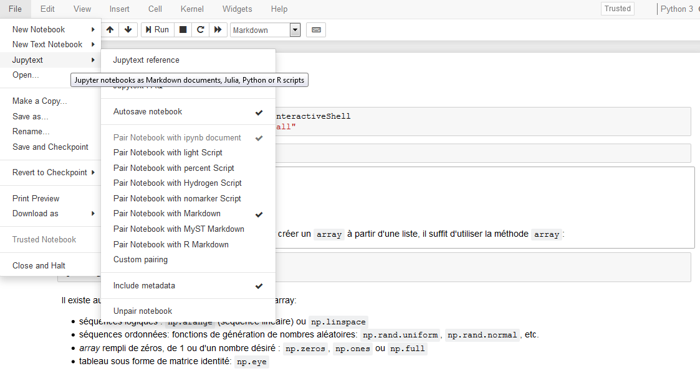

# python-datascientist

:warning: :construction: **Ce site est en construction** :construction:

Supports associés au site disponible à l'adresse <https://linogaliana-teaching.netlify.app/>. 

Syllabus disponible [là](https://www.ensae.fr/courses/python-pour-le-data-scientist-pour-leconomiste/)

# Contribuer

Pour éditer des notebooks bien intégrés dans le site web, utiliser `jupytext`
