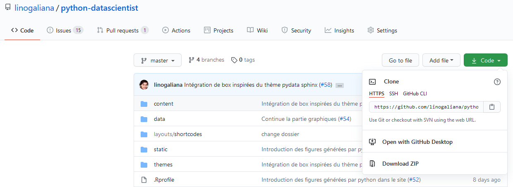
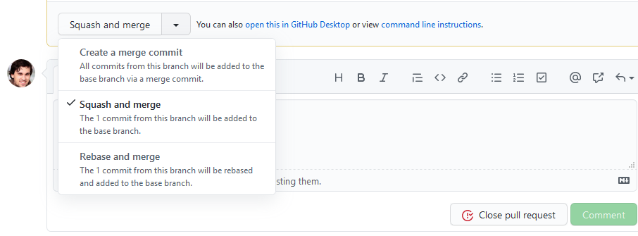

<!--- Inspirations
https://github.com/corent01/03-Swartz/blob/master/Parcours/01-La-prairie/git/exercice-git-cadavre-exquis.md
https://github.com/simplonco/cadavre-request
------>

## Git tout seul

### Première étape: avoir un compte `Github`

Les deux premières étapes se font sur `Github`

{}

1. Si vous n'en avez pas déjà un, créer un compte sur `github.com`
2. Créer un dépôt vide. Ce dépôt sera personnel, vous pouvez le rendre public
ou non, comme vous le souhaitez.
{}

Pour ces exercices, je propose d'utiliser `Github` dont les fonctionalités
nous suffiront amplement. Si, 
dans le futur, les fonctionalités ne vous conviennent pas (sans l'apport de fonctionalités
externes, `Github` propose moins de fonctionalités que `Gitlab`) ou vous êtes
mal à l'aise avec le possesseur de `Github` (Microsoft), vous pourrez utiliser
`Gitlab` <i class="fab fa-gitlab"></i>, le concurrent.
L'avantage de `Github` par rapport à `Gitlab` est que le premier est plus visible, car
mieux indexé par `Google` et concentre, en partie pour des raisons historiques, plus
de développeurs `Python` et `R` (ce qui est important dans des domaines comme
le code où les externalités de réseau jouent). Le débat `Github` vs `Gitlab` n'a
plus beaucoup de sens aujourd'hui car les fonctionalités ont convergé (`Github` 
a rattrapé une partie de son retard sur l'intégration continue) et, de toute
manière, on peut tout à fait connecter des dépôts Gitlab et Github (c'est le cas
du dépôt source <a href="https://github.com/linogaliana/python-datascientist" class="github"><i class="fab fa-github"></i></a> et <a href="https://gitlab.com/linogaliana/python-datascientist" class="github"><i class="fab fa-gitlab"></i></a> de ce cours). 

### Pratique en local

Maintenant, en local. Il faut ouvrir une invite de commande `git bash` (ou une
interface graphique connectée à `git bash`)

{}

1. Sur les postes ENSAE. Aller dans `Scientific Apps/Git`. Vous devriez voir
un raccourci `bash.exe`. Vous pouvez lancer l'application ; elle ouvre une 
invite de commande
2. Créer un dossier de travail, par exemple `Desktop/gitexo`. Dans `git bash`,
faire 

~~~shell
# remplacer par le dossier qui vous intéresse
cd 'Desktop/gitexo'
~~~

3. Initialiser le contrôle de version en tapant dans l'invite de commande

~~~shell
git init
~~~

{}

Pour le moment, on a uniquement initialisé le contrôle de version avec `Git`. 
On n'a encore ajouté aucun fichier à `Git`. D'ailleurs, la première 
chose à faire est d'exclure un certain nombre de fichiers, afin de ne pas
faire une erreur pénible à réparer.

{}

Lorsqu'on utilise `Git`, il y a des fichiers qu'on ne veut pas partager
ou dont on ne veut pas suivre les modifications. C'est le fichier `.gitignore`
qui gère les fichiers exclus du contrôle de version.

1. Maintenant, créer un fichier nommé `.gitignore` (:warning: ne pas changer
ce nom) via le bloc note ou votre IDE. 
1. Aller sur le site <https://www.toptal.com/developers/gitignore>. Vous pouvez
dans la barre de recherche taper  `Python`, `Pycharm`, `JupyterNotebooks`. 
Copier-coller dans votre `.gitignore` le contenu de la page. 
1. Quand on crée de la documentation, on veut exclure les extensions `.pdf`
et `.html` qui sont des résultats à partager et non des fichiers source à
suivre. Pour cela, ajouter au début du fichier `.gitignore`, les extensions:

~~~markdown
.pdf
.html
~~~

{}

On a créé un fichier `.gitignore` mais on n'a encore rien fait jusqu'à présent.
Il faut dire à `Git` de contrôler les évolutions de chaque fichier 
(passage dans l'index). On appelle cette étape `git add`. ****

{}

1. De temps en temps, il est bon de vérifier l'état d'un dépôt. Pour cela, faire

~~~shell
git status
~~~

1. Dans l'invite de commande, taper

~~~shell
git add .gitignore
~~~

2. Retaper `git status`. Observer le changement. Les nouvelles modifications (en
l'occurrence la création du fichier et la validation de son contenu actuel)
ne sont pas encore archivées. Pour cela, il faut faire

~~~shell
git commit -m "Initial commit"
~~~

{}

L'option `m` permet de créer un message, qui sera disponible à l'ensemble
des contributeurs du projet. Avec la ligne de commande, ce n'est pas toujours
très pratique. Les interfaces graphiques permettent des messages plus
développés (la bonne pratique veut qu'on écrive un message de commit comme un
mail succinct: un titre et un peu d'explications, si besoin).

Le fait de nommer le premier commit *"Initial commit"* est une
habitude, vous
n'êtes pas obligé de suivre cette convention si elle ne vous plaît pas.

### Premières interactions avec `Github`

{}

1. Maintenant, créer un fichier nommé `README.md` (:warning: ne pas changer
ce nom) via le bloc note ou votre IDE. 
2. Y écrire une phrase au format, sujet-verbe-complément mais sans majuscule ni ponctuation.
Observer le statut du fichier avec `git status`.
3. Valider cette création avec le message *"j'écris comme un surréaliste*

Il convient maintenant d'envoyer les fichiers sur le dépôt distant. 
1. Récupérer l'url du dépôt. Dans `Github`, il faut cliquer sur
le bouton `Code`, comme ci-dessous

2. Créer la connexion avec le dépôt distant (`remote`), qu'on va nommer `origin`,
en utilisant la commande suivante:

~~~~shell
git remote add origin ****
~~~~
Remplacer les astérisques par l'url du dépôt. 

3. Envoyez vos modifications vers `origin` en tapant 

~~~~shell
git push origin master
~~~~

`Git` va vous demander vos identifiants de connexion pour vérifier que vous
êtes bien autorisés à intéragir avec ce dépôt. Il faut les taper (:warning: 
comme le créateur de `Git` était un peu paranoiaque, c'est normal 
de ne pas voir le curseur avancer quand on tape des caractères pour le mot de passe,
si quelqu'un regarde votre écran il ne pourra ainsi pas savoir combien de 
caractères comporte votre mot de passe)

{}

Retournez voir le dépôt sur `Github`, vous devriez maintenant voir le fichier
`.gitignore` et le `README` devrait s'afficher en page d'accueil. 

{}

Pour le moment, vous êtes tout seul sur le dépôt. Il n'y a donc pas de 
partenaire pour modifier un fichier dans le dépôt distant. Nous verrons cela
lors de l'exercice suivant. Néanmoins, nous allons

1. Modifier le `README` par l'interface de `Github` en cliquant
sur le crayon en haut à droite de l'affichage du `README`.
L'objectif est de lui
donner un titre suivant, en ajoutant, au début du document, la ligne suivante : 

~~~text
# Mon oeuvre d'art surréaliste 
~~~

Ajouter à ce titre le mot `:penc il2:`, ce qui
affichera :pencil2: dans `Github`. 
Rédiger un titre et un message complémentaire pour faire le `commit`. Conserver
l'option par défaut `Commit directly to the master branch`

3. Editer à nouveau le `README`. Ajouter une deuxième phrase et corrigez la
ponctuation de la première. Ecrire un message de commit et valider.

4. Au dessus de l'aborescence des fichiers, vous devriez voir s'afficher le
titre du dernier commit. Vous pouvez cliquer dessus pour voir la modification
que vous avez faite.

5. Les résultats sont sur le dépôt distant mais ne sont pas sur votre ordinateur
Pour les rapatrier en local, faire

~~~shell
git pull origin master
~~~

{}

{}
`:XXXXXX:` permet, dans des systèmes qui reposent sur `Markdown`, d'afficher
des emojis. Vous pouvez [trouver une liste ici](https://gist.github.com/rxaviers/7360908)
{}

L'opération `pull` permet: 

1. A votre système local de vérifier les modifications sur le dépôt distant
que vous n'auriez pas faites
2. De les fusionner s'il n'y a pas de conflit de version ou si les conflits de
version sont automatiquement fusionnable (deux modifications d'un fichier mais
qui ne portent pas sur le même emplacement)

### Même tout seul, ne pas se limiter à `master`

Au début d’une tâche particulière ou d’un projet, il est recommandé d’ouvrir des issues. Prenant la forme d’un espace de discussion, elles correpondront à la fin à des nouvelles fonctionnalités (en anglais, features). Les issues permettent également de signaler des bugs constatés, de se les répartir et d’indiquer s’ils sont réglés ou s’ils ont avancés. Une utilisation intensive des *issues*, avec des labels adéquats, peut
même amener à se passer d'outils de gestion de projets comme `Trello`. 

La branche `master` est la branche principale. Elle se doit d'être "propre". On ne pousse pas des travaux non aboutis sur `master`, c'est très mal vu.  

Peut-on pousser directement sur `master` ? oui, pour des petites corrections, des modifications mineures dont vous êtes certains qu'elles vont fonctionner. Mais sachez que dans le cadre de projets sensibles, c'est strictement interdit. N'ayez pas peur de fixer comme règle l'interdiction de pousser sur `master` (voir section précédente), cela obligera l'équipe projet à travailler professionnellement. 

Au moindre doute, créez une branche. Les branches sont utilisées pour des travaux significatifs :

- vous travaillez seul sur une tâche qui va vous prendre plusieurs heures ou jours de travail (vous ne devez pas pousser sur `master` des travaux non aboutis);
- vous travaillez sur une fonctionnalité nouvelle et vous souhaiterez recueillir l'avis de vos collègues avant de modifier `master`;
- vous n'êtes pas certain de réussir vos modifications du premier coup et préférez faire des tests en parallèle.

{}
Les branches ne sont pas personnelles : **Toutes les branches sont publiées, le `rebase` est interdit. Le push force est également interdit.**

Il faut **absolument** bannir les usages de `push force` qui peuvent déstabiliser les copies locales des collaborateurs. S'il est nécessaire de faire un `push force`, c'est qu'il y a un problème dans la branche, à identifier et régler **sans** faire `push force`

**Tous les merges dans `master` doivent se faire par l'intermédiaire d'une merge request dans `GitLab`**. En effet, il est très mal vu de merger une branche dans master localement.

{}

{}
Comment nommer les branches ? Là encore, il y a énormément de conventions différentes. Une fréquemment observée est :

- pour les nouvelles fonctionnalités : `feature/nouvelle-fonctionnalite` où `nouvelle-fontionnalite` est un nom court résumant la fonctionnalité
- pour les corrections de bug : `issue-num` où `num` est le numéro de l'issue

N'hésitez pas à aller encore plus loin dans la normalisation  !
{}

{}
1. Ouvrir une *issue* sur `Github`. Signaler qu'il serait bien d'ajouter un emoji chat dans le README. Dans la partie de droite, cliquer sur la petite roue à côté de `Label` et cliquer sur `Edit Labels`. Créer un label `Markdown`. Retourner sur la page de l'*issue* et ajouter ce label
2. Sur votre dépôt local, créer une branche `issue-1` en faisant 

~~~shell
git checkout -b issue-1
~~~~

3. Ajouter un ou plusieurs emojis chat à la suite du titre. Valider avec `git add` et `git commit`. Faire un **deuxième commit** pour ajouter un emoji koala. Pousser les modifications locales:

~~~shell
git push origin issue-1
~~~~

4. Dans `Github`, devrait apparaître `issue-1 had recent pushes XX minutes ago`. 
Cliquer sur `Compare & Pull Request`. Donner un titre informatif à votre *pull request*. Dans le message en dessous, taper `Close #1` ce qui permettra de fermer automatiquement l'*issue 1* lorsque vous ferez le *merge*. **Ne validez pas la fusion**, on le fera dans un second temps.

5. En local, retourner sur `master`:

~~~shell
git checkout master
~~~~

Et ajouter une phrase à la suite de votre texte. Valider les modifications et les pusher. 

6. Cliquer sur `Insights` en haut du dépôt puis, à gauche sur `Network`. Vous devriez voir apparaître l'arborescence de votre dépôt. On peut voir `issue-1` comme une ramification et `master` comme le tronc.

L'objectif est maintenant de ramener les modifications faites dans `issue-1` dans la branche principale. Retournez dans l'onglet `Pull Requests`. Là, changer le type de `merge` pour `Squash and Merge`, comme ci-dessous. Vous pouvez vous reporter là [**METTRE LIEN**] pour la justification.

7. Supprimer la branche. Elle est mergée, la conserver risque d'amener à des push involontaires dessus. 

Faire la fusion et regarder le résultat dans la page d'accueil de `Github` (le `README`) et dans le graphique. 

{}

{}
La commande `checkout` est un couteau-suisse de la gestion de branche en `Git`. Elle permet en effet de basculer d'une branche à l'autre, mais aussi d'en créer, etc. 
{}

{}
L'option de fusion *Squash and Merge* permet de regrouper tous les commits d'une branche (potentiellement très nombreux) en un seul dans la branche de destination. Cela évite, sur les gros projets, des branches avec des milliers de *commits*.
{}

## Cadavre exquis: découvrir le travail collaboratif

{}
Cet exercice se fait par groupe de trois. Il y aura deux rôles dans ce scénario: un mainteneur et deux développeurs. 

1. Le mainteneur crée un dépôt sur `Github`. Il/Elle donne des droits au(x) développeur(s) du projet (`Settings > Manage Access > Invite a collaborator`).
2. Chaque membre du projet, crée une copie locale du projet grâce à la commande `git clone`. Pour cela, récupérer l'url HTTPS du dépôt en copiant l'url du dépôt que vous pouvez trouver, par exemple, dans la page d'accueil du dépôt, en dessous de `Quick setup — if you’ve done this kind of thing before`

~~~shell
git clone https://XXXXXX
~~~

3. Chaque membre du projet crée un fichier avec son nom et son prenom, selon cette structure `nom-prenom.md` en évitant les caractères spéciaux. Il écrit dedans trois phrases aléatoires, sans ponctuation ni majuscules.

4. Valider les modifications

~~~shell
git add nom-prenom.md
git commit -m "C'est l'histoire de XXXXX"
~~~

5. Chacun essaie d'envoyer ses modifications locales sur le dépôt:

~~~shell
git push origin master
~~~

A ce stade, une seule personne (la plus rapide) devrait ne pas avoir rencontré de rejet du `push`. C'est normal, avant d'accepter une modification `Git` vérifie en premier lieu la cohérence de la branche avec le dépôt distant. Le premier ayant fait un `push` a modifié le dépôt commun ; les autres doivent intégrer ces modifications dans leur version locale avant d'avoir le droit de proposer un  changement.

6. Pour celui/celle/ceux dont le `push` a été refusé, faire

~~~shell
git pull origin master
~~~

pour ramener les modifications distantes en local. 

7. Taper `git log` et regarder la manière dont a été intégré la modification de votre camarade ayant pu faire son `push`

8. Faire à nouveau 

~~~shell
git pull origin master
~~~

Le dernier doit refaire, à nouveau, les étapes 6 à 8
{}

{}
Quand on fait face à un rejet du `push`, on est tenté de faire passer en force le `push` malgré la mise en garde précédente.

Il faut immédiatement oublier cette solution, elle crée de nombreux problèmes et, en fait, ne résoud rien. L'un des risques est de réécrire entièrement l'historique rendant les copies locales, et donc les modifications de vos collaborateurs, caduques. Cela vous vaudra, à raison, des remontrances de vos partenaires qui perdent le bénéfice de leur historique `Git` qui, s'ils ont des versions sans `push` depuis longtemps peuvent avoir diverger fortement du dépôt maître. 

{}

{}
Chaque personne va travailler sur les fichiers des deux autres membres.

1. Les deux développeurs ajoutent la ponctuation et les majuscules
2. Sauter une ligne et ajouter une phrase
3. Valider les résultats (`add` et `commit`) et faire un `push`
4. La personne la plus rapide n'a, normalement, rencontré aucune difficulté (elle peut s'arrêter temporairement pour regarder ce qui va se passer chez les voisins, en respectant la distanciation sociale :mask:). Les autres voient leur `push` refusé. Faire un `pull`. 

:boom: Il y a conflit, ce qui doit être signalé par un message du type:

~~~shell
Auto-merging XXXXXX
CONFLICT (content): Merge conflict in XXXXXX.md
Automatic merge failed; fix conflicts and then commit the result.
~~~

5. Etudier le résultat de `git status` 

6. Si vous ouvrez les fichiers incriminés, vous devriez voir des balises du type

~~~markdown
<<<<<<< HEAD
this is some content to mess with
content to append
=======
totally different content to merge later
>>>>>>> new_branch_to_merge_later
~~~

7. Corriger à la main les fichiers en choisissant, pour chaque ligne, la version qui vous convient et en retirant les balises. Valider en faisant: 

~~~shell
git add . && git commit -m "Résolution du conflit par XXXX"
~~~
Remplacer XXX par votre nom. La balise `&&` permet d'enchaîner, en une seule ligne de code, les deux commandes. `git add .` signifie qu'on ajoute à l'*index* de `Git` toutes les modifications sur les fichiers déjà suivis. 

8. Faire un push. Pour la dernière personnes, refaire les opérations 4 à 8

{}

`Git` permet donc de travailler, en même temps, sur le même fichier et de limiter le nombre de gestes manuels nécessaires pour faire la fusion. Lorsqu'on travaille sur des bouts différents du même fichier, on n'a même pas besoin de faire de modification manuelle, la fusion peut être automatique.

`Git` est un outil très puissant. Mais, il ne remplace pas une bonne organisation du travail. Vous l'avez vu, ce mode de travail uniquement sur `master` peut être pénible. Les branches prennent tout leur sens dans ce cas. 

{}
1. Le mainteneur va contribuer directement dans `master` et ne crée pas de branche. Chaque développeur crée une branche, en local nommée `contrib-XXXXX` où `XXXXX` est le prénom: 

~~~shell
git checkout -b contrib-prenom
~~~

2. Chaque membre du groupe crée un fichier `README.md` où il écrit une phrase sujet-verbe-complément. Le mainteneur est le seul à ajouter un titre à l'oeuvre d'art en cours de création

3. Chacun pousse le produit de son subconscient sur le dépôt.

4. Les développeurs ouvrent, chacun, une `pull request` sur `Github` de leur branche vers `master`. Ils lui donnent un titre explicite. 

5. Dans la discussion de chaque `pull request`, le mainteneur demande au développeur d'intégrer la première phrase qu'il a écrite.  

6. Les développeurs, en local, intègrent cette modification en faisant

~~~shell
# Pour être sûr d'être sur la branche personnelle
git checkout branche-prenom
git merge master
~~~

Régler le conflit et valider (`add` et `commit`). Pousser le résultat. Le mainteneur choisit une des `pull request` et la valide avec l'option `squash commits`. Vérifier sur la page d'accueil le résultat.

7. L'auteur de la `pull request` non validée doit à nouveau répéter l'opération 6. 

8. Une fois le conflit de version réglé et poussé, le mainteneur valide la `pull request` selon la même procédure que précedemment. 

9. Vérifier l'arborescence du dépôt dans `Insights > Network`. Votre arbre doit avoir une forme caractéristique de ce qu'on appelle le `Github flow`:

{}

{}
Les merges vers `master` doivent impérativement passer par `Github` (ou `Gitlab`). Cela permet de garder une trace explicite de ceux-ci (par exemple [ici](https://github.com/linogaliana/python-datascientist/pulls?q=is%3Apr+is%3Aclosed)), sans avoir à chercher dans l'arborescence, parfois complexe, d'un projet. La bonne pratique veut qu'on faire un `squash commit` pour éviter une inflation du nombre de commits dans `master`: les branches ont vocation à proposer une multitude de petits commits, les modifications dans `master` doivent être simple à tracer d'où le fait de modifier des petits. 

Le cas échéant, il est très pratique d’ajouer dans le corps du message close `#xx` où `xx` est le numéro de l’issue décrivant la fonctionnalité que la MR implémente. Lorsque la MR sera fusionnée, l’issue sera automatiquement fermée et un lien sera créé entre l’issue et la MR. Cela vous permettra de comprendre, plusieurs mois ou années plus tard comment et pourquoi telle ou telle fonctionnalité a été implémentée.

L'intégration des dernières modifications de `master` vers une branche se fait en local. Si votre branche est en conflit, **le conflit doit être résolu dans la branche et pas dans master**. 
{}

{}
Vous devez savoir qu’il y a plusieurs méthodes de travail avec `Git` (*flow*, en anglais). Vous pourrez trouvez des dizaines d’articles et d’ouvrages sur ce sujet dont chacun prétend avoir trouvé la meilleure organisation du travail (`Git flow`, `GitHub flow`, `GitLab flow`…). Ne lisez pas trop ces livres et articles sinon vous serez perdus (un peu comme avec les magazines destinés aux jeunes parents...)

La méthode de travail la plus simple est le *Github flow* qu'on vous a proposé d'adopter. L'arborescence est reconnaissable: des branches divergent et reviennent systématiquement vers `master`. 

Pour des projets plus complexes dans des équipes développant des applications, on pourra utiliser d'autres méthodes de travail, notamment le `Git flow`. Il n'existe pas de règles universelles pour déterminer la méthode de travail ; l'important c'est, avant tout, de se mettre d'accord sur des règles communes de travail.
{}